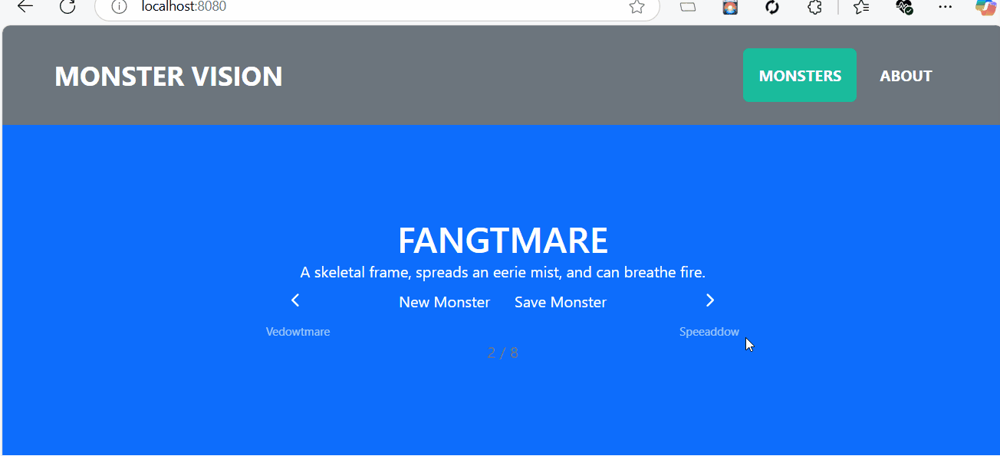

# Monster Service with Docker

A full-stack application that includes an **ASP.NET Core Web API** for managing monsters and an **Angular client** for interacting with the API. The application uses an in-memory database for data storage and is containerized using Docker.



## Quick Start

1. Download [Docker](https://www.docker.com/products/docker-desktop).
2. Run the container `docker-compose up -d`.

*This will pull the container image from the GitHub Docker Registry.*

## Features

- **ASP.NET Core Web API**:
  - Endpoints for creating, retrieving, and managing monsters.
  - In-memory database for lightweight data storage.
  - Swagger/OpenAPI integration for API documentation.

- **Angular Client**:
  - User interface for viewing and adding monsters.
  - Integration with the Web API using `fetch` for HTTP requests.
  - Bootstrap-based responsive design.

- **Dockerized Deployment**:
  - Single Docker container for both the API and the Angular client.
  - Configured to run in production with proper port bindings.

## Prerequisites

- [.NET 6 or later](https://dotnet.microsoft.com/download)
- [Node.js](https://nodejs.org/) (for the Angular client)
- [Docker](https://www.docker.com/) (optional, for containerized deployment)

## Getting Started

### 1. Clone the Repository

```bash
git clone <repository-url>
cd MonsterService
```

### 2. Run the API Locally

1. Navigate to the Service directory:
    ```bash
    cd Service
    ```

2. Run the API:
    ```bash
    dotnet run
    ```

3. The API will be available at http://localhost:5127 (or the port specified in your configuration).

### 3. Run the Angular Client Locally

1. Navigate to the Client directory:
    ```bash
    cd Client
    ```

2. Install dependencies:
    ```bash
    npm install
    ```

3. Run the Angular development server:
    ```bash
    ng serve
    ```

4. The client will be available at http://localhost:4200

### 4. Run the Application with Docker

1. Build the Docker image:
    ```bash
    docker build -t monster-service .
    ```

2. Run the Docker container:
    ```bash
    docker run -d -p 8080:80 --name monster-service monster-service
    ```

3. Access the application at http://localhost:8080

## Building and Publishing Docker Image

After making changes to the project, the Docker container can be built and published to the Github Container Registry using the following steps.

```bash
docker login --username <USERNAME> --password <YOUR_PERSONAL_ACCESS_TOKEN> ghcr.io
docker build -t ghcr.io/primaryobjects/docker-monster:latest .
docker push ghcr.io/primaryobjects/docker-monster:latest
```

### Running the Docker Image

The Docker image can be launched using the following command to read `docker-compose.yml`.

```bash
docker-compose up -d
```

Alternatively, manually launch the container.

```bash
docker run --name docker-monster-container -d -p 8080:80 ghcr.io/primaryobjects/docker-monster:latest
```

## API Endpoints

Base URL: `/api/monster`

- GET `/api/monster`: Retrieve all monsters.
- GET `/api/monster/new`: Generate a new monster.
- POST `/api/monster`: Add a new monster.

## Technologies Used

- **Backend**: ASP.NET Core, Entity Framework Core (InMemory Database)
- **Frontend**: Angular, Bootstrap
- **Containerization**: Docker
- **API Documentation**: Swagger/OpenAPI

## Project Structure

```text
MonsterService/
├── Client/                 # Angular client
├── Service/                # ASP.NET Core Web API
│   ├── Controllers/        # API controllers
│   ├── Database/           # DbContext and database setup
│   ├── Managers/           # Business logic
│   ├── Types/              # Entity models
├── Dockerfile              # Docker configuration
```

## Future Enhancements

- Add authentication and authorization.
- Implement persistent database storage (e.g., SQL Server or PostgreSQL).
- Add unit and integration tests for both the API and the client.
- Enhance the UI with additional features like monster filtering and sorting.

## License

MIT

## Author

Kory Becker
https://primaryobjects.com
